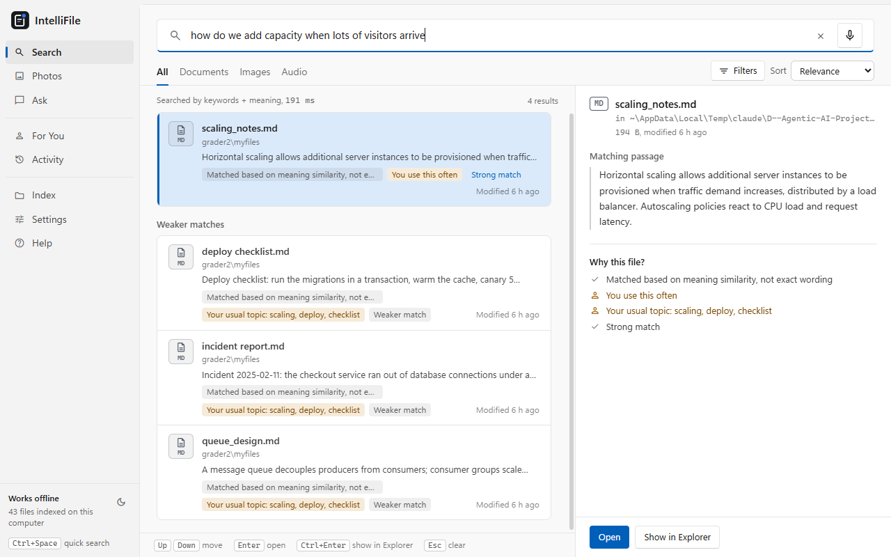
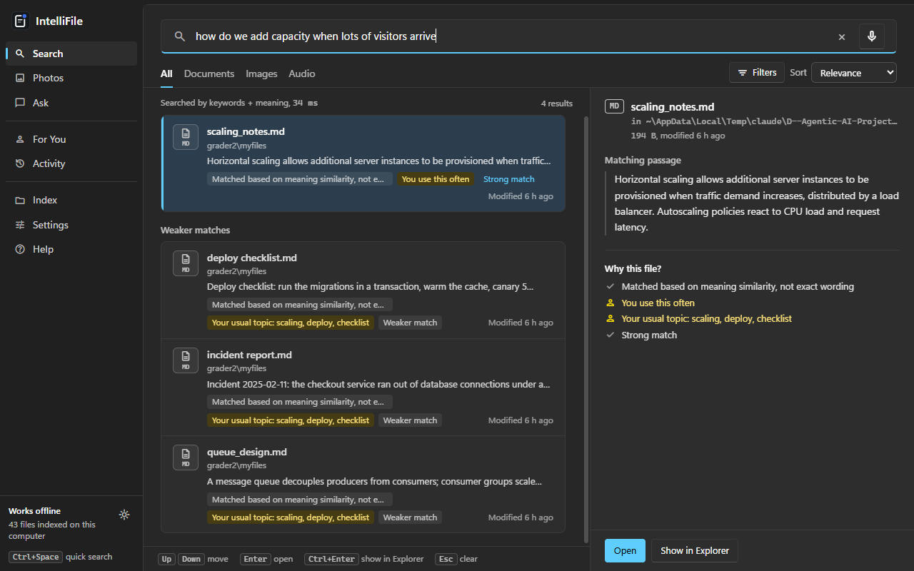

# IntelliFile

Find a file on your Windows PC by describing what is in it. IntelliFile searches the contents of your documents, spoken audio, photos and scanned pages, answers questions from your own files with citations, and learns which files you use. It runs entirely on your computer: no account, no internet, nothing uploaded.





## Course objectives

This project fulfills three course objectives for "Agentic AI-based Intelligent File Recommendation":

| Objective | Implementation | Evidence |
|---|---|---|
| 1. Agent selects a retrieval strategy | Ask tab: local Qwen2.5 model plans searches, calls them as tools, and answers with citations; the code checks correctness | [docs/REPORT.md](docs/REPORT.md) section 4.3; `backend/data/eval_agent.json` |
| 2. Personalized file recommendation | For You page, activity history, profile (frequency, recency, type, topic, time of day); re-ranks near-tied results | [docs/REPORT.md](docs/REPORT.md) section 4.2; `backend/data/eval_personalization.json` |
| 3. Intelligent retrieval routing | Adaptive router picks the cheapest search per query (file name, metadata, keyword, hybrid, hybrid+reranker); same top-5 accuracy at 76% of hybrid's time | [docs/REPORT.md](docs/REPORT.md) section 4.1; `backend/data/eval_routing.json` |

See [docs/DEMO_SCRIPT.md](docs/DEMO_SCRIPT.md) for a guided walkthrough.

## What it does

- **Search by meaning or by words.** "notes about handling traffic spikes" finds `scaling_notes.md` even though the file never uses those words. Misspellings are corrected against the words in your own files.
- **Ask a question.** Start a search with `?` and a local language model reads the best passages and answers in a sentence or two, citing the files it used. The code checks that every number in the answer is in the files, and every citation supports it. The closest passage appears immediately while the answer is written.
- **Choose the cheapest search that works.** Each query is routed to file-name, metadata, keyword or hybrid search, with re-ranking only when needed. On the labelled test set this keeps full hybrid quality (100% of the right files in the top 5) at about 76% of the time.
- **Learn how you work.** Files you open often, at a given time of day, of your usual types and topics rank a little higher, and each result says why. For You shows what has been learned, and Activity everything it remembered. Optionally, it can start from Windows' own Recent items list.
- **Read more than text.** Documents: PDF, Word, Excel, PowerPoint, text, Markdown, CSV, HTML, code. Audio transcribed (speech becomes searchable). Photos and video (searched by description and by text in the frames). Scanned PDFs and screenshots (read with Windows' built-in text recognition). Old Office formats (.doc, .xls, .ppt) supported best-effort; password-protected or damaged files listed with a reason.
- **Looks like Windows.** Designed after Windows 11 File Explorer, in Day and Night; follow Windows or pick one in Settings or with the sidebar button.
- **Stay out of the way.** Folders are watched for changes, indexing pauses in power-saving mode, broken files are skipped and listed, and the quick-search window opens anywhere with Ctrl+Space.

## Download and run

IntelliFile comes as one zip file, `IntelliFile-windows.zip` (1.87 GB), with everything in it, including the Ask model. The zip bundles FFmpeg with the GPL-licensed x264 and x265 encoders (through the PyAV video library, which only decodes); their licence texts are in the `licenses` folder next to `IntelliFile.exe`, and their source is at ffmpeg.org, code.videolan.org/videolan/x264 and bitbucket.org/multicoreware/x265_git.

1. Download `IntelliFile-windows.zip` from the project's GitHub Releases page (or build it yourself, see below).
2. Extract it, for example to your Desktop. This creates one `IntelliFile` folder.
3. Open the `IntelliFile` folder and run `IntelliFile.exe`. The first start takes 25 to 34 seconds while the search engine loads its models; the sidebar shows "Starting" then "Works offline" at the bottom left. Later launches are faster.

The app is not code-signed, so Windows SmartScreen may say "Windows protected your PC". Choose **More info**, then **Run anyway**.

Requirements: Windows 10 or 11 (64-bit), about 3 GB of disk space, 8 GB of memory (16 GB recommended for Ask mode). No administrator rights are needed. Step-by-step instructions, including what to try first, are in [docs/HOW_TO_RUN.md](docs/HOW_TO_RUN.md). The full [user manual](docs/USER_MANUAL.md) is also built into the app, under **Help**.

## How it works

A Tauri desktop app starts a Python search engine on the same computer and talks to it over `127.0.0.1` with a key that changes at every start. The engine indexes each passage twice, by its words (SQLite FTS5) and by its meaning (bge-small vectors in LanceDB), and merges both rankings. A router picks the cheapest search for each query; a local Qwen2.5 model answers questions from the retrieved passages; the code, not the model, checks that every answer is supported by the files it cites.

The full design, with diagrams, is in [docs/ARCHITECTURE.md](docs/ARCHITECTURE.md).

## Build from source

Windows, Python 3.11, Node.js and Rust are needed. The complete steps are in [docs/BUILD_WINDOWS.md](docs/BUILD_WINDOWS.md). In short:

```powershell
cd backend
py -3.11 -m venv venv
.\venv\Scripts\python.exe -m pip install -r requirements-dev.txt --extra-index-url https://abetlen.github.io/llama-cpp-python/whl/cpu
.\venv\Scripts\python.exe scripts\download_embedding_model.py   # and the other download_*.py scripts
.\venv\Scripts\python.exe scripts\run_all_phases.py             # the full test suite, offline
cd ..\desktop
npm install
npm run tauri dev
```

The model download scripts are the only part of the project that uses the internet, and only on a developer's machine. The built app never connects to anything.

## Testing and measurements

What works and what does not, with the measured numbers, is in [docs/TEST_REPORT.md](docs/TEST_REPORT.md).

Every feature has a script under `backend/scripts/` that exercises it end to end on real files. `run_all_phases.py` runs them all under a guard that fails on any network connection. Retrieval, routing, personalization, the agent and each improvement are measured on a generated, labelled corpus; the numbers and the history of every bug fix are in [docs/DEVELOPMENT_LOG.md](docs/DEVELOPMENT_LOG.md).

`check_features.py` checks the finished features the way the app uses them: it builds a test folder of documents in six formats, photos, a screenshot with text, a video and a spoken recording, and checks that each is identified correctly, offline and without changing a file. When something fails it prints the evidence for the cause. It runs against the source or a release (`--packaged`); the test commands are in [docs/BUILD_WINDOWS.md](docs/BUILD_WINDOWS.md).

## Known limits

- **English only.** The text, speech and re-ranking models are English models (bge-small-en, Whisper base.en, MS MARCO). Files and speech in other languages are searched and transcribed poorly.
- **Ask is a small model.** It runs a 1.5 billion parameter model on the CPU (about 12 to 15 seconds on a typical laptop, 20 to 45 s on a busy one). It can over-read a related fact: asked for a "project deadline" when only an invoice due date exists, it may answer with that date. It cites the file it used, so check the source. On a set of 30 questions, 24 of 25 answerable questions cited the right file; see [docs/TEST_REPORT.md](docs/TEST_REPORT.md).
- **Photo search is approximate.** On 26 real photos the right picture is first 50% of the time and in the top 3 for 78%; near-identical pictures are often swapped.
- **Measured on generated files, on one laptop.** Accuracy numbers come from a generated, labelled corpus and real photos; the scale test is in [docs/TEST_REPORT.md](docs/TEST_REPORT.md). The zip has not yet been run on a second, clean PC.
- **Windows only, not code-signed, no installer or auto-update.** To remove everything, delete the `IntelliFile` folder and `%LOCALAPPDATA%\IntelliFile`.

## Privacy

IntelliFile reads only the folders you allow, never changes your files, and keeps its index and history in `%LOCALAPPDATA%\IntelliFile`. The privacy policy and the terms of use are in the app under Settings.

## Licence

MIT, see [LICENSE](LICENSE). The models, fonts, word list and libraries keep their own licences. Contributions are welcome.
