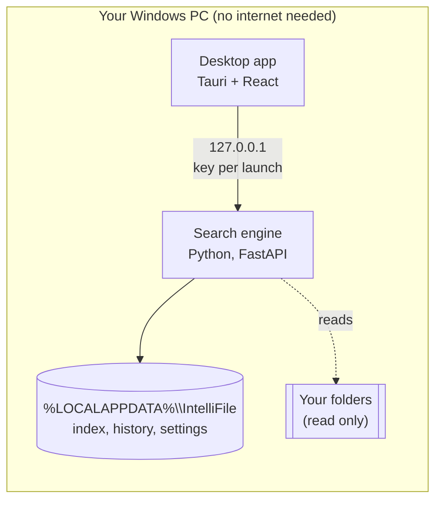

# How IntelliFile works

IntelliFile is two programs on the same Windows computer: a desktop app (Tauri, React) and a search engine (Python, FastAPI). Nothing leaves the machine. This page shows how the two programs connect, then the final architecture: indexing, search, photo search, personalization, Ask, and where the agentic AI is.

## The two programs



The app starts the engine when it opens and stops it when it closes. If the app crashes, the engine notices and exits too. Every request carries a key created at launch, so no other program on the computer can read the index.

## The final architecture

This is the reference description of the system, checked against the code on 27 September 2026. Every box names something in the code; the principles at the end are the rules each part follows.

```
┌──────────────────────────────────────────────────────────────────────────────┐
│                                 INTELLIFILE                                  │
│                              LOCAL OFFLINE AI                                │
│                   NO CLOUD, NO NETWORK, READ-ONLY, WINDOWS                   │
└──────────────────────────────────────────────────────────────────────────────┘


══════════════════════════════════════════════════════════════════════════════
1. INDEXING PIPELINE
══════════════════════════════════════════════════════════════════════════════

                          Folders allowed by the user
                                      │
                                      ▼
                 Watch live Windows changes, 30 s debounce,
                     plus a full scan at every app start
                                      │
                                      ▼
                             CHANGE DETECTION
                size + modified time, then SHA-256 when needed
                                      │
      ┌───────────────────┬───────────┴────────┬──────────────────────┐
      ▼                   ▼                    ▼                      ▼
  Unchanged        Renamed, same hash       Deleted            New / changed
      │                   │                    │                      │
      ▼                   ▼                    ▼                      ▼
    SKIP          UPDATE PATH ONLY     REMOVE FROM INDEX      CONTENT PROCESSING
                                                                      │
          ┌─────────────────────┬─────────────────┬───────────────────┤
          ▼                     ▼                 ▼                   ▼
    Text / Office       Scans / screenshots     Audio          Photos / videos
          │                     │                 │                   │
          ▼                     ▼                 ▼                   ▼
   Text extraction         Windows OCR         Whisper               CLIP
          │                     │                 │                   │
          └─────────────────────┼─────────────────┘                   │
                                ▼                                     ▼
                  Text passages (224 tokens)                    Image vectors
                                │                                     │
                     ┌──────────┴──────────┐                          ▼
                     ▼                     ▼                  LanceDB image store
                SQLite FTS5          LanceDB text            (used only by the
                 keywords               vectors                Photos page)

      Every indexed file also has a FILE RECORD (name, path, size, dates, hash).
      Photos that contain text also go through OCR, so screenshots are
      searchable by their words.


══════════════════════════════════════════════════════════════════════════════
2. NORMAL SEARCH (TEXT OR VOICE)
══════════════════════════════════════════════════════════════════════════════

                          Text query / voice query
                                      │
                                      ▼
                          Whisper, if voice input
                                      │
                                      ▼
                            QUERY UNDERSTANDING
          filters (type, date, size, folder), typo correction from your
          own vocabulary, question detection, file-name detection
                                      │
                                      ▼
                         ┌────────────────────────┐
                         │    ADAPTIVE ROUTER     │
                         │   agentic decision:    │
                         │    picks ONE tier      │
                         └───────────┬────────────┘
                                     │
         ┌──────────────┬────────────┴───┬──────────────────┐
         ▼              ▼                ▼                  ▼
     File name      Metadata         Keywords       Keywords + meaning
         │              │                │              (hybrid)
         │              │                │                  │
         └──────────────┴───────┬────────┴──────────────────┘
                                ▼
                          SEARCH INDEX
         ┌──────────────────────┼──────────────────────┐
         ▼                      ▼                      ▼
    File records           SQLite FTS5            LanceDB text
  names, sizes, dates         BM25                   vectors
         └──────────────────────┼──────────────────────┘
                                ▼
                           CANDIDATES
                                │
                                ▼
                         CONFIDENCE CHECK
                          │            │
                         YES           NO
                          │            ▼
                          │     ESCALATE ONE TIER
                          │            │
                          │            ▼
                          │   SEARCH INDEX AGAIN
                          │            │
                          │            ▼
                          │       STILL UNSURE?
                          │        │         │
                          │       NO        YES
                          │        │         ▼
                          │        │   CROSS-ENCODER
                          │        │     RERANKER
                          │        │         │
                          └────────┴────┬────┘
                                        ▼
                                   CANDIDATES
                                        │
                                        ▼
                     PERSONALIZATION, near-ties only
             frequency, recency, file type, topic, time of day
                                        │
                                        ▼
                          FINAL RESULTS + EXPLANATION
              why it matched, personal reason, strong or weak,
                    search route and time taken
                                        │
                                        ▼
               suggests Ask when a question found nothing confident


══════════════════════════════════════════════════════════════════════════════
3. PHOTOS AND VIDEOS SEARCH (SEPARATE PATH)
══════════════════════════════════════════════════════════════════════════════

                         User opens the Photos page
                                      │
                                      ▼
                   Describes a picture: CLIP text query
                                      │
                                      ▼
                         LanceDB image vectors
                                      │
                                      ▼
                        Photos and video moments

        CLIP image vectors never enter the normal search candidates.

        A photo that contains text:
              Photo ──→ CLIP ──→ image vectors   (Photos page)
                │
                └────→ OCR ───→ text passages    (normal search)


══════════════════════════════════════════════════════════════════════════════
4. PERSONALIZATION AND MEMORY
══════════════════════════════════════════════════════════════════════════════

                 Local activity history (optional, can be cleared)
              searches, opened files, revealed files, clicks, times
         + Windows Recent items, only if the user switches the import on
                                      │
                                      ▼
                                   PROFILE
                                      │
         ┌────────────────────────────┼────────────────────────────┐
         ▼                            ▼                            ▼
     RANKING                   RECOMMENDATIONS                 ASK CONTEXT
  (near-ties only)            (before you type)            (for the planner)
         │                            │                            │
  frequency, recency,          files used together,         current session,
  file type, topic,            usual at this time,          usual topics
  time of day                  used most
         │                            │                            │
         ▼                            ▼                            ▼
   Final results                 Search page                  Ask planner


══════════════════════════════════════════════════════════════════════════════
5. ASK MODE (SEPARATE, STARTED BY THE USER)
══════════════════════════════════════════════════════════════════════════════

                       User asks with ? or the Ask button
                                      │
                                      ▼
                   FIRST-LOOK SEARCH (the router picks the route)
                                      │
                                      ▼
               QUICK EVIDENCE: the closest passage, shown at once
                                      │
                                      ▼
                         QWEN2.5-1.5B PLANNER (local)
                   working context: current session, usual topics
                                      │
                                      ▼
                          IS THE EVIDENCE ENOUGH?
                            │                 │
                           YES                NO
                            │                 ▼
                            │            CHOOSE A TOOL
                            │          ┌──────┴────────┐
                            │          ▼               ▼
                            │       Search          Read more
                            │     new words,       of a source
                            │   mode, filters          │
                            │          └───────┬───────┘
                            │                  ▼
                            │          back to the PLANNER
                            │
                            │   at most 4 tool calls, including the first look
                            │   25 s planning budget, 50 s hard cap
                            ▼
                  LOCAL LLM WRITES THE ANSWER with [n] citations
                                      │
                                      ▼
                          CODE GROUNDING CHECK
                                      │
                    ┌─────────────────┼──────────────────────┐
                    ▼                 ▼                      ▼
             Citations support   Question premise     Figures not in the
             the answer?         in the sources?      sources?
             (extra ones                                     │
              removed)                                       ▼
                    │                 │              WARNING shown,
                    └────────┬────────┘              answer stays visible
                             ▼
                      GROUNDING RESULT
                       │            │
                     PASS          FAIL
                       │            │
                       ▼            ▼
              Answer + citations   "I couldn't find that in your files"


══════════════════════════════════════════════════════════════════════════════
6. WHERE THE AGENTIC AI IS
══════════════════════════════════════════════════════════════════════════════

 ┌────────────────────────────────────────────────────────────────────────────┐
 │ 1. ASK AGENT (the LLM agent)                              Objective 1      │
 │    Qwen2.5-1.5B: plan → search or read → observe → decide → write answer   │
 │    → checked by the code                                                    │
 ├────────────────────────────────────────────────────────────────────────────┤
 │ 2. ADAPTIVE SEARCH ROUTER                                 Objective 3      │
 │    picks one tier → retrieves → checks confidence → escalates if needed    │
 │    → reranks only if still unsure; can learn from your own searches        │
 ├────────────────────────────────────────────────────────────────────────────┤
 │ 3. MEMORY AND PERSONALIZATION                             Objective 2      │
 │    activity history → profile → near-tie ranking, recommendations,         │
 │    and working context for the Ask agent                                    │
 └────────────────────────────────────────────────────────────────────────────┘

 Supporting autonomous behaviour (not an AI agent): Windows file watching,
 automatic index maintenance, power-aware indexing (pauses on battery).
```

Escalation follows a fixed order: file name, then keywords, then keywords + meaning, then keywords + meaning with the cross-encoder reranker. A metadata query (filters only) lists the matching files and never escalates.

## Final principles

1. The reranker never comes before retrieval.
2. The router picks one of 4 tiers; every tier reads the search index.
3. "Keywords + meaning" is the hybrid tier.
4. File name and metadata tiers read the file records.
5. CLIP image vectors stay in their own store and never join text results.
6. Photo search is a separate path: CLIP text query to image vectors.
7. OCR reads scans, screenshots and photos that contain text.
8. Only new or changed files are processed.
9. Unchanged files are skipped.
10. Renamed files update their path only.
11. Deleted files are removed from the index.
12. Ask is a separate mode that the user starts.
13. Normal search only suggests Ask when a question found nothing confident.
14. Ranking signals, recommendations and Ask context are separate uses of the same profile.
15. Personalization reorders near-ties only.
16. Ask uses at most 4 tool calls, including the first look.
17. Ask has a 25 s planning budget and a 50 s hard cap.
18. Unsupported figures produce a warning; only citations and premise decide pass or fail.
19. There are 3 agentic AI components: the Ask agent, the adaptive router, and memory and personalization.
20. File watching and power-aware indexing are supporting autonomy.
21. IntelliFile is offline, uses local models, and never changes the user's files.

## Where each part is in the code

The code is already arranged the way the architecture is drawn: each section has its own package. Paths are under `backend/app/` unless they say otherwise.

| Section | Box in the architecture | Code |
|---|---|---|
| The two programs | Desktop app, Ctrl+Space window | `desktop/src` (React), `desktop/src-tauri` (Rust shell) |
| | Local API with a key per launch, offline guard | `main.py`, `offline_guard.py` |
| **1. Indexing** | Watch live changes, 30 s debounce | `files/service.py`, `files/debounce.py`, `watch_setup.py` |
| | Folders allowed by the user | `files/access.py`, `files/discovery.py` |
| | Change detection (size + time, then SHA-256), full scan at start, rename, skip | `indexing/folder_scan.py`, `files/identity.py` |
| | Deleted files removed from the index | `indexing/cleanup.py` |
| | Text / Office extraction | `extraction/` (one extractor per file type) |
| | Windows OCR for scans, screenshots and photos with text | `extraction/ocr.py`, `extraction/pdf_extractor.py`, `indexing/indexer.py` (`index_image_text`) |
| | Whisper for audio | `transcription/` |
| | CLIP for photos and video frames | `embeddings/clip_model.py`, `indexing/visual_indexer.py` |
| | Text passages (224 tokens) | `chunking/chunker.py`, `indexing/indexer.py` |
| | File records, SQLite FTS5, LanceDB text and image vectors | `storage/sqlite_store.py`, `storage/keyword_store.py`, `storage/lancedb_store.py`, `embeddings/model.py` |
| | Power-aware indexing | `power/` |
| **2. Normal search** | Query understanding: filters | `search/query_parsing.py` |
| | Typo correction from your own vocabulary | `search/spelling.py`, `search/grammar.py`, `search/dictionary.py` |
| | Question and file-name detection | `search/router.py`, `search/filenames.py` |
| | Adaptive router (rules, or learned from your searches) | `search/router.py`, `search/learned_router.py` |
| | Search index, candidates, confidence check, escalation | `search/service.py`, `search/fusion.py` |
| | Cross-encoder reranker | `search/reranker.py` |
| | Personalization, near-ties only | `search/service.py` (`_personalize`) |
| | Final results + explanation, weak results capped | `search/explain.py`, `search/service.py` (`_prune_weak`) |
| **3. Photos and videos** | CLIP text query to image vectors | `visual_search/service.py`, `thumbnails.py` |
| **4. Personalization and memory** | Activity history | `context/usage_store.py` |
| | Windows Recent items import | `context/windows_recent.py` |
| | Profile (frequency, recency, type, topic, time, files used together) | `context/profile.py` |
| | Recommendations | `context/recommendations.py` |
| | Settings (remember activity, personalize, import) | `context/settings.py` |
| **5. Ask mode** | Agent loop: first look, quick evidence, planner, tools, limits, grounding check | `agent/loop.py` |
| | Tools (search, read more) and the working context | `agent/tools.py` |
| | Local Qwen2.5-1.5B model | `agent/llm.py` |
| **6. Where the agentic AI is** | Ask agent / adaptive router / memory | `agent/` / `search/router.py`, `search/learned_router.py`, `search/service.py` / `context/` |
| Tests | One end-to-end script per part, run together offline | `backend/scripts/run_all_phases.py`, `backend/scripts/prototype_*.py`, `backend/scripts/evaluate_*.py` |
